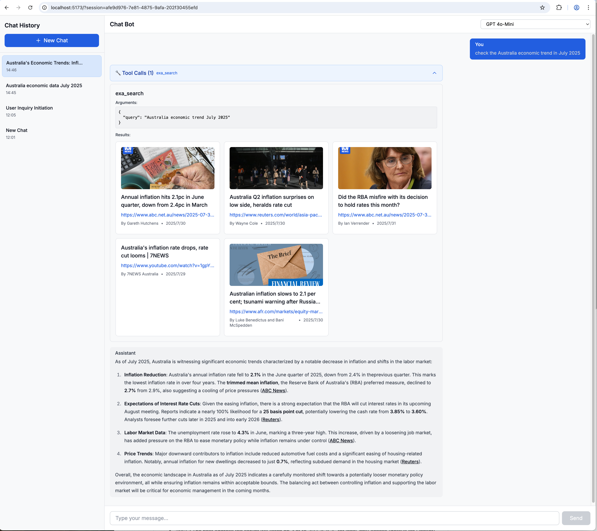

# AI Chat Bot

An intelligent chat application built with Remix, featuring OpenAI integration, web search capabilities, and a modern responsive interface.



## Features

### 🤖 AI Conversation
- **OpenAI Integration**: Powered by GPT models for intelligent conversations
- **Multiple Model Support**: Choose from different OpenAI models for varied responses
- **Streaming Responses**: Real-time message streaming for better user experience

### 🔍 Web Search Integration
- **Exa Search Tool**: Built-in web search capabilities using Exa API
- **Tool Call Visualization**: Clear display of tool usage and results
- **Collapsible Tool Details**: Keep conversations clean with expandable tool information

### 💬 Session Management
- **Persistent Chat Sessions**: All conversations are saved and can be resumed
- **Automatic Titling**: AI-generated descriptive titles for each conversation
- **Manual Renaming**: Edit conversation titles with inline editing
- **Session History**: Access all previous conversations from the sidebar

### 🎨 Modern UI/UX
- **Responsive Design**: Optimized for both desktop and mobile devices
- **Collapsible Sidebar**: Clean interface with expandable conversation history
- **Dark/Light Theme Ready**: Built with Tailwind CSS for easy theming
- **Markdown Support**: Rich text rendering with syntax highlighting

### 🔧 Technical Features
- **URL-based Routing**: Direct links to specific conversations
- **Database Persistence**: PostgreSQL with Prisma ORM
- **Docker Support**: Easy deployment with Docker Compose
- **TypeScript**: Full type safety throughout the application


## Development

Run the dev server:

```sh
npm run dev
```

## Environment Variables

This project uses environment variables for configuration. A `.env.example` file is provided as a template. To set up your environment variables, copy this file to `.env` and fill in the necessary values:

```sh
cp .env.example .env
```

Key environment variables include:

*   `HOST`: The host address the server will listen on. Set to `127.0.0.1` for local-only access (default for Docker). For external access, you might set it to `0.0.0.0`.
*   `PORT`: The port the server will listen on. The default production port is `3000`.

## Deployment

### Using Docker

To build and run the application using Docker, make sure you have Docker installed and then run the following commands in the project root:

```sh
docker-compose build
docker-compose up
```

The application will be accessible at `http://localhost:3000`.

### Without Docker

First, build your app for production:

```sh
npm run build
```

Then run the app in production mode:

```sh
npm run start
```

Now you'll need to pick a host to deploy it to.

### DIY

If you're familiar with deploying Node applications, the built-in Remix app server is production-ready.

Make sure to deploy the output of `npm run build`

- `build/server`
- `build/client`

## Styling

This template comes with [Tailwind CSS](https://tailwindcss.com/) already configured for a simple default starting experience. You can use whatever css framework you prefer. See the [Vite docs on css](https://vitejs.dev/guide/features.html#css) for more information.
